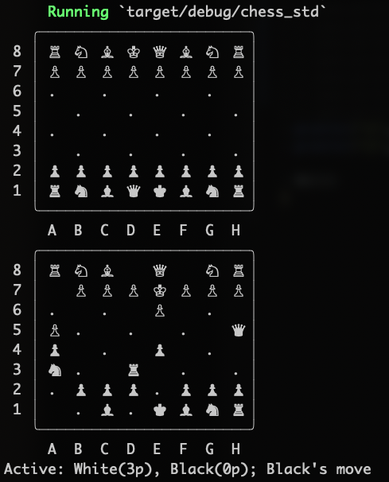

# indachess
*Chess rule engine in rust, see chess_std*

### Quick start:

- `git clone <url> indachess && cd $_`
- `cd chess_std`
- `cargo test`
- `cargo run`
- `cargo build --release && ./targets/release/chess_std --clear-screen`

### Contributing

- fork repo (or be added as contributor)
- make issue
- make feature branch `feature/XXX-keyword` where `XXX` is the github issue number and `keyword` is something descriptive regarding the issue
- make change
- `cargo fmt && cargo clippy && cargo test` should have no issues
- commit
- make pull-request
- potentially receive peer-review + make changes + update peer-review + repeat until approved + merged

### Meta

// created by Leonard Pauli, sep 2020
